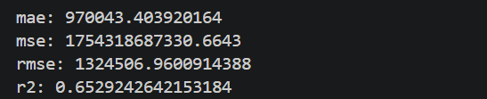
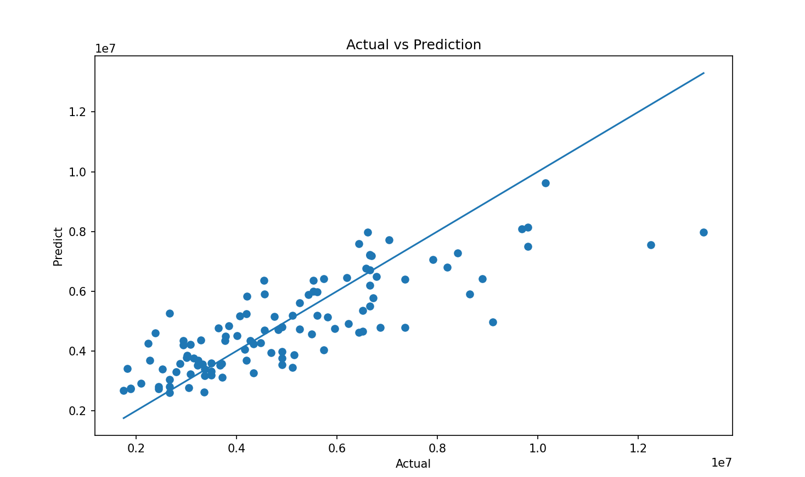

# House Price Prediction using Linear Regression

## Project Overview
This project predicts house prices using Machine Learning and Linear Regression. The model is trained on housing data and can estimate the price of a new house based on features such as area, bedrooms, bathrooms, stories, parking, and amenities.

## Tools & Technologies
- Python
- Pandas
- NumPy
- Matplotlib
- Scikit-Learn
- Pickle

## Project Workflow
1. Data Collection
2. Data Cleaning
3. Missing Value Checking
4. Duplicate Value Checking
5. Data Preprocessing
6. Feature Encoding using One-Hot Encoding
7. Train-Test Split
8. Linear Regression Model Training
9. Model Evaluation
10. House Price Prediction
11. Model Saving using Pickle

## Evaluation Metrics
- Mean Absolute Error (MAE)
- Mean Squared Error (MSE)
- Root Mean Squared Error (RMSE)
- R² Score

## Project Screenshots

### Missing Values Checking

### Check Duplicate Values

### Evaluation Metrics

### New House Prediction

### Actual vs Predicted Graph

## Future Improvements
- Deploy using Streamlit
- Add more advanced ML models
- Build a web application for predictions

## Author
**Anil Kumar**

Aspiring Data Analyst | Power BI | Python | Machine Learning
